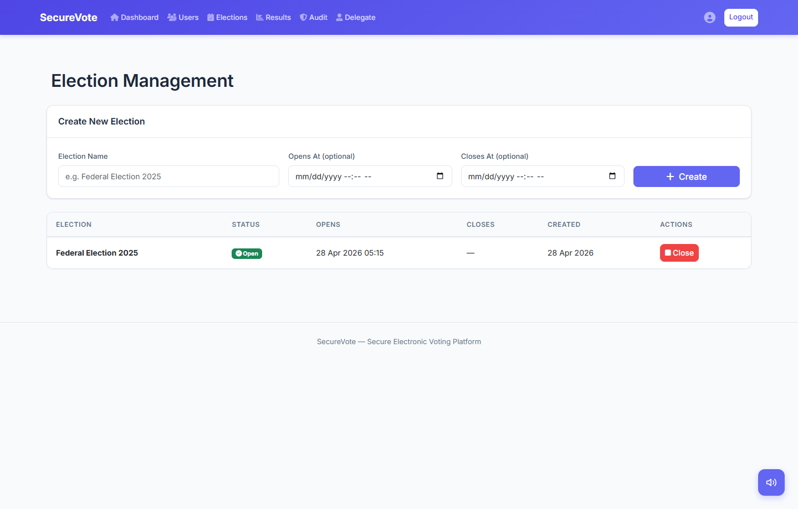

# SecureVote: Secure Electronic Voting Platform

SecureVote is a Flask-based secure voting system built to demonstrate security engineering evidence: voter anonymity, encrypted PII, tamper-evident audit logs, access control, WAF enforcement, Vault-backed signing, and race-condition testing.

This started as a Secure Software Systems team project and was later completed, hardened, documented, and tested as a solo portfolio project.

## About this project

SecureVote is a security-engineering portfolio project for showing how a voting application can separate identity, ballot authority, ballot submission, auditability, and operational hardening. The project is designed to be reviewed through code, tests, documentation, and a local demo rather than as a public hosted election system.

The main point is not that online voting is easy. It is that sensitive workflows need layered controls that are testable: blind signatures for ballot anonymity, encrypted PII, role-based access control, tamper-evident audit logs, CSRF protection, WAF rules, Vault-backed signing, and race-condition tests for double-vote prevention.

I keep the public claim intentionally narrow: this is a reproducible security prototype and evidence package, not a production election service.



## Security Controls at a Glance

| Security area | Implementation | Evidence in repo |
| --- | --- | --- |
| Anonymous voting | RSA blind signatures, browser-side unblinding, separate anonymous `/vote/cast` endpoint with no cookies or session data | `app/security/blind_signature.py`, `app/static/js/blind_vote.js`, `tests/test_blind_signature.py` |
| PII protection | ChaCha20-Poly1305 encryption for voter PII and HMAC-SHA256 blind indexes for driver licence lookup | `app/security/encryption.py`, `app/models.py`, `tests/test_pii_encryption_and_access.py` |
| Audit integrity | HMAC-SHA256 JSONL audit chain with previous-record linkage and manager-visible chain verification | `app/logging_service.py`, `app/routes/audit.py` |
| Authentication hardening | Password policy, account lockout, password expiry, signed password reset tokens, email OTP MFA, anti-bot login nonce, honeypot, Origin/Referer checks | `app/auth.py`, `app/security/password_validator.py`, `tests/test_password_policy.py`, `tests/integration/test_login_robot_blocking.py` |
| Authorization | Voter, delegate, and manager roles with route-level guards and region-limited delegate candidate management | `app/utils/auth_decorators.py`, `app/routes/candidates.py`, `app/routes/elections.py` |
| CSRF protection | Per-session CSRF tokens on state-changing requests with targeted exemptions for public verification and anonymous ballot endpoints | `app/security/csrf.py`, form templates |
| WAF and rate limiting | nginx fronted by OWASP ModSecurity CRS with endpoint-specific request limits, security headers, and isolated backend service exposure | `nginx/conf.d/waf.conf`, `docker-compose.yml` |
| Result integrity | Election result signing and verification through HashiCorp Vault Transit when configured, with local RSA fallback for development | `app/security/signing_service.py`, `app/security/vault_client.py`, `docs/VAULT_SETUP.md` |
| Double-vote prevention | `SELECT ... FOR UPDATE`, transactional `VoteReceipt`, and a unique `user_id` constraint to stop TOCTOU double voting | `app/vote_service.py`, `tests/test_vote_concurrency.py` |
| Production safety | Environment-aware settings, split database binds, local-only developer dashboard controls, and deployment safety documentation | `app/environment.py`, `app/utils/db_utils.py`, `docs/PRODUCTION_SAFETY_REPORT.md` |

## What This Proves for Security Analyst Roles

- Can translate security requirements into concrete application controls, not just describe them.
- Understands anonymity, integrity, authentication, authorization, auditability, and operational hardening tradeoffs.
- Can write reproducible security tests for password policy, PII access, blind signatures, login automation controls, pagination limits, and race conditions.
- Can document implementation evidence clearly enough for reviewers to verify claims from the code and tests.
- Can reason about deployment boundaries: WAF in front, app isolated behind nginx, MySQL internal only, Vault used for signing, secrets excluded from git.

## Security Architecture

```text
                    +-----------------------------+
  User browser ---> | nginx + ModSecurity CRS WAF |  Rate limits, CRS rules, security headers
                    +-------------+---------------+
                                  |
                                  v
                    +-------------+---------------+
                    | Flask application            |  Auth, RBAC, CSRF, MFA, blind signatures
                    +-------------+---------------+
                                  |
                 +----------------+----------------+
                 |                                 |
                 v                                 v
        +--------+---------+              +--------+---------+
        | MySQL / SQLite   |              | HashiCorp Vault  |
        | Split DB binds   |              | Transit signing  |
        | Encrypted PII    |              | KV secret pattern |
        +------------------+              +------------------+
```

### Blind Signature Voting Flow

```text
Phase 1: Authenticated voter requests authority
  Browser creates ballot hash and blinds it.
  Server signs the blinded value.
  Server records a VoteReceipt so the voter cannot request another ballot.
  Server never sees the unblinded ballot.

Phase 2: Anonymous ballot submission
  Browser unblinds the signature.
  Browser sends ballot plus signature to /vote/cast.
  The endpoint does not use cookies or session identity.
  Server verifies the signature and records an anonymous Vote.
```

### Data and Integrity Controls

- PII is encrypted using ChaCha20-Poly1305 before storage.
- Driver licence lookup uses an HMAC-SHA256 blind index with a high-entropy pepper.
- Audit events are appended as HMAC-signed JSON lines with `prev_hmac` chaining.
- Election results can be signed through Vault Transit and verified through `/results/verify`.
- Voting concurrency is tested with 10 simultaneous attempts against the same voter.

## Tech Stack

| Layer | Technology |
| --- | --- |
| Backend | Flask 2.3, SQLAlchemy, Flask-Login, Flask-Mail, Flask-Migrate |
| Database | MySQL 8.0 for Docker, SQLite for local development and tests |
| Security | RSA blind signatures, ChaCha20-Poly1305, HMAC-SHA256, PyJWT, itsdangerous, HashiCorp Vault |
| Infrastructure | Docker Compose, nginx, OWASP ModSecurity CRS, Gunicorn |
| Testing | pytest, pytest-flask, GitHub Actions |
| Frontend | Jinja2, Bootstrap 5, Inter, browser Web Speech API |

## How to Run Demo Locally

### Option 1: Local SQLite Demo

```bash
python -m venv .venv
source .venv/bin/activate
python -m pip install -r requirements.txt
python scripts/run_demo.py
```

Open `http://127.0.0.1:5000`.

On Windows PowerShell, activate the virtual environment with:

```powershell
.\.venv\Scripts\Activate.ps1
python -m pip install -r requirements.txt
python scripts\run_demo.py
```

### Option 2: Full Docker Stack with WAF, MySQL, and Vault

```bash
cp .env.example .env
# Fill in strong local values in .env before starting the stack.
docker-compose up --build -d
```

Open:

- App through WAF: `http://localhost`
- Vault dev UI: `http://localhost:8200`

### Demo Credentials

| Role | Username | Password |
| --- | --- | --- |
| Manager | `admin` | `Admin@123456!` |
| Delegate | `delegate1` | `Delegate@123!` |
| Voter | `voter1` | `Password@123!` |

## Testing and Verification

Install test dependencies and run the suite:

```bash
python -m pip install -r requirements.txt -r requirements-dev.txt
python -m pytest
```

Current collection: 104 pytest tests.

| Test area | File | Count |
| --- | --- | ---: |
| Blind signature protocol and HTTP flow | `tests/test_blind_signature.py` | 8 |
| Password reset, election access, anonymity, audit page | `tests/test_new_features.py` | 14 |
| Pagination limit enforcement | `tests/test_pagination_security.py` | 2 |
| Account lockout, expiry, and password change | `tests/test_password_policy.py` | 19 |
| Password validation and registration integration | `tests/test_password_validation.py` | 26 |
| PII encryption and access control | `tests/test_pii_encryption_and_access.py` | 3 |
| Core smoke tests, role access, voting, results | `tests/test_smoke.py` | 15 |
| Concurrent vote race-condition checks | `tests/test_vote_concurrency.py` | 2 |
| Login nonce, CLI blocking, honeypot, Origin/Referer checks | `tests/integration/test_login_robot_blocking.py` | 15 |

## Repo Hygiene

The repository is configured to exclude local secrets and generated runtime files:

- `.env` and local `.env.*` files
- SQLite and local database files
- `instance/`, logs, and audit logs
- Python caches, pytest cache, coverage output, and virtual environments
- Local package-manager lock files generated during experiments

## Documentation

- [Password Policy](docs/PASSWORD_POLICY.md)
- [Vault Setup](docs/VAULT_SETUP.md)
- [Environment Detection](docs/ENVIRONMENT_DETECTION.md)
- [Production Safety Report](docs/PRODUCTION_SAFETY_REPORT.md)
- [CI/CD Guide](.github/CI_CD_GUIDE.md)
- [Testing Guide](tests/README.md)

## Note on Public Demo

This project is intended to be reviewed as code, tests, and local demo evidence. A public hosted demo is intentionally not required for a voting-system portfolio project.

## License

[MIT](LICENSE)
