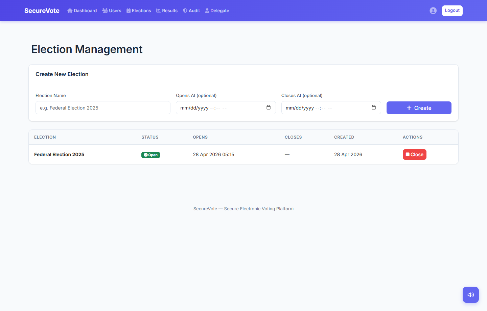

# SecureVote: Secure Electronic Voting Platform

SecureVote is a Flask-based secure voting system built to demonstrate security engineering evidence: blind-ballot anonymity, encrypted high-risk identity fields, tamper-evident audit logs, access control, WAF configuration, Vault-backed signing, race-condition testing, and a human-readable verification rehearsal.

This started as a Secure Software Systems team project and was later completed, hardened, documented, and tested as a solo portfolio project.

## About this project

SecureVote is a security-engineering portfolio project for showing how a voting application can separate identity, ballot authority, ballot submission, auditability, and operational hardening. The project is designed to be reviewed through code, tests, documentation, and a local demo rather than as a public hosted election system.

The main point is not that online voting is easy. It is that sensitive workflows need layered controls that are testable: blind signatures for ballot anonymity, encryption for selected high-risk identity fields, role-based access control, tamper-evident audit logs, CSRF protection, WAF rules, Vault-backed signing, and race-condition tests for double-vote prevention.

I keep the public claim intentionally narrow: this is a reproducible security prototype and evidence package, not a production election service.



## Security Controls at a Glance

| Security area | Implementation | Evidence in repo |
| --- | --- | --- |
| Anonymous voting | Immutable per-election RSA blind-signing keys anchored by fingerprint, browser-side unblinding, an identity-only one-time authorization, and a separate identity-free spent-nullifier record at `/vote/cast` | `app/security/blind_signature.py`, `app/static/js/blind_vote.js`, `tests/test_blind_election_binding.py` |
| Identity-field protection | Versioned ChaCha20-Poly1305 envelopes protect driver licence, electoral-roll name, address, suburb, state, and postcode fields and fail closed on malformed, tampered, or wrong-key values; HMAC-SHA256 blind indexes support driver licence lookup | `app/security/encryption.py`, `app/models.py`, `tests/test_pii_encryption_and_access.py` |
| Audit integrity | Privacy-minimal post-commit events for core administration, ballot, and result mutations in an HMAC-SHA256 JSONL chain with manager-visible verification | `app/logging_service.py`, `app/routes/audit.py`, `tests/test_audit_completeness.py` |
| Authentication hardening | JWT-authoritative sessions with password-version revocation, single-use resets, verified-email approval gates, password policy, lockout, expiry, email OTP MFA, and login automation controls | `app/auth.py`, `app/security/jwt_helpers.py`, `tests/test_auth_session_security.py`, `tests/integration/test_login_robot_blocking.py` |
| Authorization | Voter, delegate, and manager roles with route-level guards and region-limited delegate candidate management | `app/utils/auth_decorators.py`, `app/routes/candidates.py`, `app/routes/elections.py` |
| CSRF protection | Per-session CSRF tokens on state-changing requests with targeted exemptions for public verification and anonymous ballot endpoints | `app/security/csrf.py`, form templates |
| WAF and rate limiting | nginx/OWASP CRS configuration with endpoint-specific request limits, security headers, and isolated backend exposure; live blocking remains a pre-deployment test | `nginx/conf.d/waf.conf`, `docker-compose.yml` |
| Result integrity | Closed-election results reject ORM mutation after first signing and retain the exact Vault envelope or an archived local RSA public key, fingerprint, backend, algorithm, and key version for fail-closed verification | `app/security/signing_service.py`, `app/security/vault_client.py`, `tests/test_result_signing_integrity.py` |
| Election domain integrity | Candidates, ballots, receipts, authorizations, nullifiers, and signed results carry an `election_id`; rosters freeze at opening, and the prototype permits exactly one region and one contest per election | `app/models.py`, `app/routes/elections.py`, `tests/test_election_integrity.py` |
| Double-vote prevention | Locked eligibility revalidation, one blind authorization per voter and election, and identity-free spent-nullifier uniqueness stop authorization and ballot replay | `app/routes/main.py`, `tests/test_blind_election_binding.py` |
| Verification rehearsal | Public, data-free observer checklist with explicit trust assumptions, stop conditions, non-claims, native controls, and announced progress | `app/templates/verification_ceremony.html`, `docs/VERIFICATION_CEREMONY.md`, `tests/test_verification_ceremony.py` |
| Production safety | Environment-aware settings, tested request-aware database binds with environment-driven least-privilege accounts, local-only developer controls, and deployment safety documentation | `app/environment.py`, `app/utils/db_utils.py`, `scripts/init_db_users.py` |

## What This Proves for Security Analyst Roles

- Can translate security requirements into concrete application controls, not just describe them.
- Understands anonymity, integrity, authentication, authorization, auditability, and operational hardening tradeoffs.
- Can write reproducible security tests for password policy, PII access, blind signatures, login automation controls, pagination limits, and race conditions.
- Can document implementation evidence clearly enough for reviewers to verify claims from the code and tests.
- Can separate cryptographic evidence from the human trust, accessibility, and governance assumptions around an election process.
- Can reason about deployment boundaries: WAF in front, app isolated behind nginx, MySQL internal only, Vault used for signing, secrets excluded from git.

## Security Architecture

```text
                    +-----------------------------+
  User browser ---> | nginx + ModSecurity CRS WAF |  Rate limits, CRS rules, security headers
                    +-------------+---------------+
                                  |
                                  v
                    +-------------+---------------+
                    | Flask application            |  Auth, RBAC, CSRF, MFA, blind signatures
                    +-------------+---------------+
                                  |
                 +----------------+----------------+
                 |                                 |
                 v                                 v
        +--------+---------+              +--------+---------+
        | MySQL / SQLite   |              | HashiCorp Vault  |
        | Split DB binds   |              | Transit signing  |
        | Encrypted high-  |              | Scoped web token  |
        | risk ID fields   |              |                   |
        +------------------+              +------------------+
```

### Blind Signature Voting Flow

```text
Phase 1: Authenticated voter requests authority
  Browser creates ballot hash and blinds it.
  Browser obtains the public key anchored to that election in the database.
  Server locks and revalidates the voter and enrolment.
  Server permits only the voter's single-region, single-contest election.
  Server records one identity-side authorization with no ballot-derived value.
  Server signs with that election's immutable key. A lost authorization cannot be reissued.
  Server never sees the unblinded ballot.

Phase 2: Anonymous ballot submission
  Browser unblinds the signature.
  Browser sends ballot plus signature to /vote/cast without cookies.
  Server verifies the active election, candidate, and blind signature.
  Server atomically stores an identity-free spent nullifier and anonymous Vote.
  The endpoint explicitly ignores any accidentally attached session identity
  and forces the least-privileged voter database bind.
```

The identity-side dashboard deliberately cannot confirm whether a blind ballot
was cast, because doing so would recreate the identity-to-ballot link. Network
metadata and small-anonymity-set timing remain prototype limitations. This is
not an end-to-end verifiable or production election system. Database-level
administrators remain a trust anchor: ORM immutability guards do not replace an
external bulletin board, append-only log, or independent election audit.

### Data and Integrity Controls

- Driver licence, electoral-roll name, address, suburb, state, and postcode
  use a versioned ChaCha20-Poly1305 envelope before storage. Invalid, tampered,
  unversioned, and wrong-key values raise instead of becoming plaintext
  application data.
- Email, electoral-roll date of birth, user licence state, enrolment status,
  and operational metadata remain plaintext in the database. This is a
  residual data-minimization risk, so deployments must restrict database and
  manager access and avoid collecting fields that are not required.
- Driver licence lookup uses an HMAC-SHA256 blind index with a high-entropy pepper.
- The v1 PII envelope uses deployment-wide associated data. A database
  administrator remains trusted not to swap valid ciphertext between fields or
  rows; field- and row-bound associated data is future hardening work.
- Audit events are appended as HMAC-signed JSON lines with `prev_hmac` chaining.
- Authorization and anonymous-cast events intentionally omit candidate,
  ballot, nonce, receipt, IP, and cross-phase identifiers. Audit timestamps
  can still create timing-correlation risk for a privileged log reader.
- Closed-election results can be signed through Vault Transit, persisted in the database, and verified through `/results/verify`.
- Open-election blind-signing keys are anchored by SHA-256 fingerprint. Missing or replaced key files stop voting instead of rotating silently.
- Verification and reset links are bearer tokens. Before any shared-log
  deployment, WAF and access-log policy must suppress or redact those route
  paths and restrict log access until the tokens expire.
- The identity-linked `/vote` form path is disabled. JavaScript and Web Crypto
  are required for the supported blind anonymous ballot flow; there is no
  direct no-JavaScript ballot fallback.
- Tally database failures fail closed with HTTP 503 and can never be projected as synthetic zero-vote results.

## Tech Stack

| Layer | Technology |
| --- | --- |
| Backend | Flask 3.1, SQLAlchemy, Flask-Login, Flask-Mail, Flask-Migrate |
| Database | MySQL 8.4 LTS for Docker, SQLite for local development and tests |
| Security | RSA blind signatures, ChaCha20-Poly1305, HMAC-SHA256, PyJWT, itsdangerous, HashiCorp Vault |
| Infrastructure | Docker Compose, nginx, OWASP ModSecurity CRS, Gunicorn |
| Testing | pytest, pytest-flask, GitHub Actions |
| Frontend | Jinja2, Bootstrap 5, Inter, browser Web Speech API |

## How to Run Demo Locally

### Option 1: Local SQLite Demo

```bash
python -m venv .venv
source .venv/bin/activate
python -m pip install -r requirements.txt
cp .env.example .env
# Generate and fill SECRET_KEY, VOTER_PII_KEY_BASE64,
# LICENSE_HASH_PEPPER, and AUDIT_HMAC_KEY. Also configure MAIL_SERVER,
# MAIL_USERNAME, MAIL_PASSWORD, and MAIL_DEFAULT_SENDER because verified email
# is mandatory. For this SQLite server set:
# PUBLIC_BASE_URL=http://127.0.0.1:5000
# TRUSTED_HOSTS=127.0.0.1,localhost
python scripts/run_demo.py
```

Open `http://127.0.0.1:5000`.

### Upgrade an existing database

Back up the database, stop all application writes, and apply the election-scoping
migration before running this version. The same command also bootstraps a fresh
empty database:

```powershell
python -m flask db upgrade
```

The migration preserves existing candidates and ballots under the oldest
known election, removes the legacy `vote.user_id` identity link, invalidates
legacy blind authorizations, and adds spent-nullifier, server-side OTP, and
durable signed-result storage. It also widens short PII columns for the
versioned AEAD envelope. Both the election-integrity migration and the PII
width migration are forward-only. Narrowing can truncate authenticated
ciphertext, and reconstructing identity links would violate the new ballot
model. After a successful upgrade, roll back application code only while
retaining the upgraded schema. If MySQL fails after partial DDL, restore the
pre-upgrade database backup before correcting the cause and retrying.

Runtime reads deliberately reject old unversioned PII. Back up the database,
review its format, and validate one explicit conversion mode before applying
it. There is no auto-detection mode:

```powershell
# Old unversioned ChaCha20-Poly1305 values
python scripts/migrate_pii_envelope.py --source legacy-chacha
python scripts/migrate_pii_envelope.py --source legacy-chacha --apply

# Old Fernet values require the matching OLD_FERNET_KEY
python scripts/migrate_pii_envelope.py --source legacy-fernet
python scripts/migrate_pii_envelope.py --source legacy-fernet --apply

# Reviewed plaintext must first be prefixed in the database with
# svpii:legacy-plaintext:v0:, then validated and applied explicitly.
python scripts/migrate_pii_envelope.py --source marked-plaintext
python scripts/migrate_pii_envelope.py --source marked-plaintext --apply
```

Any malformed, mixed, unmarked, tampered, or wrong-key value aborts the
transaction without partially migrating the database. After the migration,
`scripts/anchor_open_election_keys.py` validates all existing anchors and gives
an open legacy election its first per-election key only when it has no issued
authorization records. If legacy authorization rows ever existed for an open
election, the migration records a durable recovery-required flag before
deleting those linkable rows; the election is quarantined and key creation
fails closed. The admin and voter database binds are
credential views of the same schema, so each migration runs once.

For the Compose/MySQL stack, do not run the PII conversion inside `web`: its
voter credential intentionally cannot update electoral-roll identity data.
Use the owner-credential maintenance runner during full application downtime:

```bash
docker compose stop waf web
docker compose exec db sh -c 'MYSQL_PWD="$MYSQL_ROOT_PASSWORD" mysqldump -uroot --single-transaction "$MYSQL_DATABASE"' > securevote-before-upgrade.sql
docker compose --profile maintenance run --rm migration-runner
docker compose --profile maintenance run --rm migration-runner python scripts/migrate_pii_envelope.py --source legacy-chacha
docker compose --profile maintenance run --rm migration-runner python scripts/migrate_pii_envelope.py --source legacy-chacha --apply
docker compose --profile maintenance run --rm migration-runner python scripts/migrate_pii_envelope.py --source legacy-chacha
docker compose up --build -d
```

Replace `legacy-chacha` with the reviewed source mode. The first dry-run is a
mandatory key and capacity preflight: it decrypts each value, builds the new
envelope, and rejects a wrong key or undersized column before any write. Keep
the backup until a post-start identity read succeeds. The envelope currently
has no embedded key identifier, so rotation requires an explicitly designed
offline migration and recovery plan.

For a reviewed Fernet conversion, inject the retired key into the one-shot
runner rather than persisting it in `.env`:

```bash
docker compose --profile maintenance run --rm -e OLD_FERNET_KEY migration-runner python scripts/migrate_pii_envelope.py --source legacy-fernet
docker compose --profile maintenance run --rm -e OLD_FERNET_KEY migration-runner python scripts/migrate_pii_envelope.py --source legacy-fernet --apply
```

On Windows PowerShell, activate the virtual environment with:

```powershell
.\.venv\Scripts\Activate.ps1
python -m pip install -r requirements.txt
python scripts\run_demo.py
```

### Option 2: Full Docker Stack with WAF, MySQL, and Vault

```bash
cp .env.example .env
# Fill every blank required secret and SMTP value before starting the stack.
docker compose up --build -d
docker compose logs db-init vault-init
```

Open:

- App through WAF: `http://localhost`

The checked-in Compose defaults are intentionally an HTTP-only local demo:
`.env.example` sets `DEPLOYMENT_ENV=local-demo` and
`SESSION_COOKIE_SECURE=false` so browsers can retain the login cookies on
`http://localhost`. A hosted deployment must terminate HTTPS and set both
`DEPLOYMENT_ENV=production` and `SESSION_COOKIE_SECURE=true`; application
startup fails closed if production is configured with insecure cookies.
Verification and password-reset URLs are built only from `PUBLIC_BASE_URL`,
never from the request Host header. `TRUSTED_HOSTS` must include that hostname.
Production additionally requires an HTTPS public origin and MFA. The web and
one-shot initializer both validate SMTP configuration at startup because email
ownership is a prerequisite for approval and voting. A generic, rate-limited
resend flow recovers pending accounts after transient mail failure without
disclosing whether an account exists.

Compose runs migrations, reference-data bootstrap, database-account provisioning,
and Vault policy setup as one-shot services. The web container receives no
database root credential, no schema-owner credential, and only a generated
Vault token scoped to the configured Transit key. Vault is not exposed on a
host port.

The stack creates one initial manager from the `BOOTSTRAP_MANAGER_*` values in
`.env`, forces a password change at first login, and creates no demo voters,
elections, candidates, or ballots. Remove or rotate the bootstrap password
after that first login. The Compose stack still uses Vault development mode and
is for local infrastructure verification, not a production election
deployment.

### Local Demo Credentials

These predictable accounts exist only after `python scripts/run_demo.py` (or an
explicit `ALLOW_DEMO_SEED=true` initialization). They are never created by the
Docker startup path.

| Role | Username | Password |
| --- | --- | --- |
| Manager | `admin` | `Admin@123456!` |
| Delegate | `delegate1` | `Delegate@123!` |
| Voter | `voter1` | `Password@123!` |

## Testing and Verification

Install test dependencies and run the suite:

```bash
python -m pip install -r requirements.txt -r requirements-dev.txt
python -m pytest
```

Current collection: 243 pytest tests. A plain local run passes 239 and skips
four opt-in MySQL checks: two permission probes, one production-like Flask
split-bind flow, and one populated legacy-schema migration. CI runs all four
against MySQL 8.4 LTS.

| Test area | File | Count |
| --- | --- | ---: |
| Blind signature protocol, input bounds, and HTTP flow | `tests/test_blind_signature.py` | 10 |
| Election-bound key lifecycle and A-to-B exploit regression | `tests/test_blind_election_binding.py` | 7 |
| Structured audit completeness, privacy, and tamper detection | `tests/test_audit_completeness.py` | 3 |
| JWT authority, exact password handling, reset revocation, verification gating, and safe redirects | `tests/test_auth_session_security.py` | 18 |
| CSRF enforcement for authenticated JSON routes | `tests/test_csrf_json.py` | 3 |
| Request-aware database routing and identity-free ballot binding | `tests/test_database_routing.py` | 8 |
| Fail-closed deployment, Vault token, and bootstrap controls | `tests/test_deployment_safety.py` | 11 |
| Election scoping, UTC schedules, locked eligibility, single-contest/region rules, and durable results | `tests/test_election_integrity.py` | 12 |
| Fresh, legacy, and partial schema migration/ballot preservation | `tests/test_election_scope_migration.py` | 5 |
| Server-side hashed OTP storage, expiry, replay, and attempt limits | `tests/test_otp_security.py` | 4 |
| Immutable result signatures and backend/key provenance | `tests/test_result_signing_integrity.py` | 10 |
| Encrypted-field-safe administrator search | `tests/test_admin_encrypted_search.py` | 1 |
| Canonical and enumeration-resistant email delivery | `tests/test_email_delivery_security.py` | 3 |
| Minimal liveness and readiness responses | `tests/test_health_security.py` | 2 |
| Fail-closed hosted runtime configuration | `tests/test_runtime_security_config.py` | 16 |
| Password reset, election access, anonymity, audit page | `tests/test_new_features.py` | 15 |
| Pagination limit enforcement | `tests/test_pagination_security.py` | 2 |
| Account lockout, expiry, and password change | `tests/test_password_policy.py` | 19 |
| Password validation and registration integration | `tests/test_password_validation.py` | 27 |
| Versioned PII encryption, capacity preflight, migration, tamper, and access control | `tests/test_pii_encryption_and_access.py` | 23 |
| Core smoke tests, role access, voting, results | `tests/test_smoke.py` | 16 |
| Verification rehearsal accessibility and behaviour | `tests/test_verification_ceremony.py` | 7 |
| Concurrent vote race-condition checks | `tests/test_vote_concurrency.py` | 2 |
| Login nonce, CLI blocking, honeypot, Origin/Referer checks | `tests/integration/test_login_robot_blocking.py` | 15 |
| Live MySQL account authentication and least-privilege grants | `tests/integration/test_mysql_permissions.py` | 2 |
| Production-like Flask requests through real MySQL split binds | `tests/integration/test_mysql_flask_split_binds.py` | 1 |
| Populated legacy schema upgrade on real MySQL | `tests/integration/test_mysql_legacy_migration.py` | 1 |

## Repo Hygiene

The repository is configured to exclude local secrets and generated runtime files:

- `.env` and local `.env.*` files
- SQLite and local database files
- `instance/`, logs, and audit logs
- Python caches, pytest cache, coverage output, and virtual environments
- Local package-manager lock files generated during experiments

## Documentation

- [Threat Model Summary](http://127.0.0.1:5000/threat-model) - public in-app summary of assets, trust boundaries, threats, controls, residual risks, and evidence links.
- [Verification Rehearsal](http://127.0.0.1:5000/verification-ceremony) - public, data-free observer rehearsal that documents evidence limits, trust assumptions, stop conditions, and accessibility checks.
- [Verification Ceremony Guide](docs/VERIFICATION_CEREMONY.md)
- [Security Policy](SECURITY.md)
- [Password Policy](docs/PASSWORD_POLICY.md)
- [Vault Setup](docs/VAULT_SETUP.md)
- [Environment Detection](docs/ENVIRONMENT_DETECTION.md)
- [Production Safety Report](docs/PRODUCTION_SAFETY_REPORT.md)
- [CI/CD Guide](.github/CI_CD_GUIDE.md)
- [Testing Guide](tests/README.md)

## Note on Public Demo

This project is intended to be reviewed as code, tests, and local demo evidence. A public hosted demo is intentionally not required for a voting-system portfolio project.

## License

[MIT](LICENSE)
